# EduNova — Database Schema Reference

This document is a curated, visual reference for EduNova's complete database schema: a multi-tenant school-management ERP running on **PostgreSQL via Prisma**, with `School` as the root tenant that every other model ultimately scopes to (directly via a `schoolId` column, or transitively through a parent). The schema currently defines **97 models**, grouped below into 18 functional domains, each rendered as a Mermaid entity-relationship diagram followed by a Domain Map showing how the domains connect.

Diagrams follow standard crow's-foot notation: `||` = exactly one, `|o` = zero-or-one, `o{` = zero-or-many, `|{` = one-or-many. The symbol next to an entity describes that entity's own multiplicity in the relationship — e.g. `SCHOOL ||--o{ USER` reads "one School has zero or more Users." A **nullable foreign key** is always drawn as an optional relationship (`|o--o{` or `|o--o|`), never as a required one, to match the schema exactly.

Every model referenced from another domain (e.g. `User`, `Class`, `School`) is included as a **lightweight stub entity** (just `id PK`, sometimes a couple of defining fields) so relationship lines have somewhere to point — the full field list for that model lives only in its home domain's diagram, noted in a one-line caption above each diagram that needs one.

---

## 1. Core & Tenancy

`School` is the tenant root; `User` is the single account model for every role (student, parent, teacher, staff, admin, superadmin — see `role` field); `Session` backs refresh-token auth.

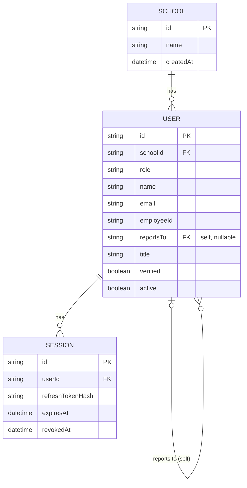

---

## 2. Academic Structure

Full `School` and `User` fields are in the Core & Tenancy diagram above; `PeriodTemplate` fields are in the Timetable diagram below (shown here only as a stub since `Class.periodTemplateId` points to it).

```mermaid
erDiagram
    SCHOOL { string id PK }
    USER { string id PK }
    PERIOD_TEMPLATE { string id PK }

    ACADEMIC_YEAR {
        string id PK
        string schoolId FK
        string label
        date startDate
        date endDate
        boolean isCurrent
    }
    TERM {
        string id PK
        string schoolId FK
        string academicYearId FK
        string name
        date startDate
        date endDate
        boolean isCurrent
    }
    BOARD {
        string id PK
        string schoolId FK
        string name
        string code
    }
    GRADE {
        string id PK
        string schoolId FK
        string label
        int order
    }
    STREAM {
        string id PK
        string schoolId FK
        string name
    }
    SUBJECT {
        string id PK
        string schoolId FK
        string name
        string code
        string color
    }
    CURRICULUM_SUBJECT {
        string id PK
        string schoolId FK
        string boardId FK
        string gradeId FK
        string streamId FK "nullable"
        string subjectId FK
        string kind "core/elective"
    }
    CLASS {
        string id PK
        string schoolId FK
        string academicYearId FK
        string boardId FK
        string gradeId FK
        string streamId FK "nullable"
        string classTeacherId FK "nullable, User"
        string periodTemplateId FK "nullable"
        string section
        int capacity
    }
    CLASS_SUBJECT {
        string id PK
        string schoolId FK
        string classId FK
        string subjectId FK
        string teacherId FK "nullable, User"
        int periodsPerWeek
    }
    ROOM {
        string id PK
        string schoolId FK
        string name
        string kind
        int capacity
    }
    ENROLLMENT {
        string id PK
        string schoolId FK
        string studentId FK "User"
        string classId FK
        string academicYearId FK
        string rollNo
        string status "active/transferred/graduated"
    }
    GUARDIAN {
        string id PK
        string schoolId FK
        string parentId FK "User"
        string studentId FK "User"
        string relation
    }

    SCHOOL ||--o{ ACADEMIC_YEAR : "has"
    SCHOOL ||--o{ TERM : "has"
    SCHOOL ||--o{ BOARD : "has"
    SCHOOL ||--o{ GRADE : "has"
    SCHOOL ||--o{ STREAM : "has"
    SCHOOL ||--o{ SUBJECT : "has"
    SCHOOL ||--o{ CURRICULUM_SUBJECT : "has"
    SCHOOL ||--o{ CLASS : "has"
    SCHOOL ||--o{ CLASS_SUBJECT : "has"
    SCHOOL ||--o{ ROOM : "has"
    SCHOOL ||--o{ ENROLLMENT : "has"
    SCHOOL ||--o{ GUARDIAN : "has"

    ACADEMIC_YEAR ||--o{ TERM : "has"
    ACADEMIC_YEAR ||--o{ CLASS : "has"
    ACADEMIC_YEAR ||--o{ ENROLLMENT : "has"

    BOARD ||--o{ CURRICULUM_SUBJECT : "teaches"
    BOARD ||--o{ CLASS : "has"
    GRADE ||--o{ CURRICULUM_SUBJECT : "has"
    GRADE ||--o{ CLASS : "has"
    STREAM |o--o{ CURRICULUM_SUBJECT : "has"
    STREAM |o--o{ CLASS : "has"
    SUBJECT ||--o{ CURRICULUM_SUBJECT : "appears in"
    SUBJECT ||--o{ CLASS_SUBJECT : "taught as"

    CLASS ||--o{ CLASS_SUBJECT : "offers"
    CLASS ||--o{ ENROLLMENT : "has"
    PERIOD_TEMPLATE |o--o{ CLASS : "default periods for"

    USER |o--o{ CLASS : "is class teacher of"
    USER |o--o{ CLASS_SUBJECT : "teaches"
    USER ||--o{ ENROLLMENT : "is student in"
    USER ||--o{ GUARDIAN : "is parent in"
    USER ||--o{ GUARDIAN : "is student in"
```

---

## 3. Timetable

Full `School`/`Term`/`Class`/`ClassSubject`/`Room`/`User` fields are in Core & Tenancy / Academic Structure. **Correction to the brief**: there is no separate "period-definition" model — `PeriodTemplate.periods` is a single `Json` column holding an inline array (`[{ idx, label, start, end, kind }]`); it is documented here as a JSON field, not a related entity.

```mermaid
erDiagram
    SCHOOL { string id PK }
    TERM { string id PK }
    CLASS { string id PK }
    CLASS_SUBJECT { string id PK }
    ROOM { string id PK }
    USER { string id PK }

    PERIOD_TEMPLATE {
        string id PK
        string schoolId FK
        string name
        boolean isDefault
        json periods "inline array: idx, label, start, end, kind"
    }
    TIMETABLE_ENTRY {
        string id PK
        string schoolId FK
        string classId FK
        string termId FK
        string classSubjectId FK
        string roomId FK "nullable"
        string teacherId FK "nullable, User"
        int dayOfWeek "1=Mon..6=Sat"
        int periodIdx
    }
    TIMETABLE_PUBLISH {
        string id PK
        string schoolId FK
        string classId FK
        string termId FK
        datetime publishedAt
    }
    SUBSTITUTION {
        string id PK
        string schoolId FK
        string timetableEntryId FK
        date date
        string substituteTeacherId FK "User"
        string reason
    }

    SCHOOL ||--o{ PERIOD_TEMPLATE : "has"
    SCHOOL ||--o{ TIMETABLE_ENTRY : "has"
    SCHOOL ||--o{ TIMETABLE_PUBLISH : "has"
    SCHOOL ||--o{ SUBSTITUTION : "has"

    CLASS ||--o{ TIMETABLE_ENTRY : "has"
    CLASS ||--o{ TIMETABLE_PUBLISH : "has"
    TERM ||--o{ TIMETABLE_ENTRY : "scopes"
    TERM ||--o{ TIMETABLE_PUBLISH : "scopes"
    CLASS_SUBJECT ||--o{ TIMETABLE_ENTRY : "scheduled as"
    ROOM |o--o{ TIMETABLE_ENTRY : "hosts"
    USER |o--o{ TIMETABLE_ENTRY : "teaches"

    TIMETABLE_ENTRY ||--o{ SUBSTITUTION : "substituted by"
    USER ||--o{ SUBSTITUTION : "substitutes as"
```

---

## 4. Attendance & Assessment

Full `School`/`User`/`Class`/`Board`/`ClassSubject`/`Term` fields are in Core & Tenancy / Academic Structure.

```mermaid
erDiagram
    SCHOOL { string id PK }
    USER { string id PK }
    CLASS { string id PK }
    BOARD { string id PK }
    CLASS_SUBJECT { string id PK }
    TERM { string id PK }

    FILE {
        string id PK
        string schoolId FK
        string uploaderId FK "nullable, User"
        string name
        string mime
        int size
        string path
        string sha256
    }
    ATTENDANCE_SESSION {
        string id PK
        string schoolId FK
        string classId FK
        date date
        int periodIdx "nullable, null=whole day"
        string markedById FK "nullable, User"
        datetime lockedAt
    }
    ATTENDANCE_RECORD {
        string id PK
        string sessionId FK
        string studentId FK "User"
        string status "P/A/L/E/H"
        string note
    }
    STAFF_ATTENDANCE {
        string id PK
        string schoolId FK
        string userId FK "User"
        date date
        string status "P/A/L/H"
        string markedById FK "nullable, User"
    }
    GRADE_SCALE {
        string id PK
        string schoolId FK
        string name
        string boardId FK "nullable"
        json bands "min, grade, points"
    }
    ASSESSMENT {
        string id PK
        string schoolId FK
        string classSubjectId FK
        string termId FK
        string name
        float maxMarks
        float weight
        datetime publishedAt
    }
    MARK {
        string id PK
        string assessmentId FK
        string studentId FK "User"
        float score
        string remark
    }
    HOMEWORK {
        string id PK
        string schoolId FK
        string classSubjectId FK
        string title
        date dueDate
        string createdById FK "nullable, User"
    }
    HOMEWORK_SUBMISSION {
        string id PK
        string homeworkId FK
        string studentId FK "User"
        datetime submittedAt
        string status "Submitted/Late/Graded/Returned"
        string grade
    }

    SCHOOL ||--o{ FILE : "has"
    SCHOOL ||--o{ ATTENDANCE_SESSION : "has"
    SCHOOL ||--o{ STAFF_ATTENDANCE : "has"
    SCHOOL ||--o{ GRADE_SCALE : "has"
    SCHOOL ||--o{ ASSESSMENT : "has"
    SCHOOL ||--o{ HOMEWORK : "has"

    USER |o--o{ FILE : "uploads"
    CLASS ||--o{ ATTENDANCE_SESSION : "has"
    USER |o--o{ ATTENDANCE_SESSION : "marks"
    ATTENDANCE_SESSION ||--o{ ATTENDANCE_RECORD : "has"
    USER ||--o{ ATTENDANCE_RECORD : "is student in"

    USER ||--o{ STAFF_ATTENDANCE : "is subject of"
    USER |o--o{ STAFF_ATTENDANCE : "marks"
    BOARD |o--o{ GRADE_SCALE : "scoped by"

    CLASS_SUBJECT ||--o{ ASSESSMENT : "has"
    TERM ||--o{ ASSESSMENT : "scopes"
    ASSESSMENT ||--o{ MARK : "has"
    USER ||--o{ MARK : "is student in"

    CLASS_SUBJECT ||--o{ HOMEWORK : "has"
    USER |o--o{ HOMEWORK : "creates"
    HOMEWORK ||--o{ HOMEWORK_SUBMISSION : "has"
    USER ||--o{ HOMEWORK_SUBMISSION : "submits"
```

---

## 5. Admissions & Identity

Full `School`/`User` fields are in Core & Tenancy. **Accuracy note**: `BoardRegistration.boardId` and `academicYearId` are plain `String` columns with **no declared Prisma `@relation`** to `Board`/`AcademicYear` in the actual schema (no back-relation field on either model either) — they are shown below as informal/unenforced references, not real foreign keys.

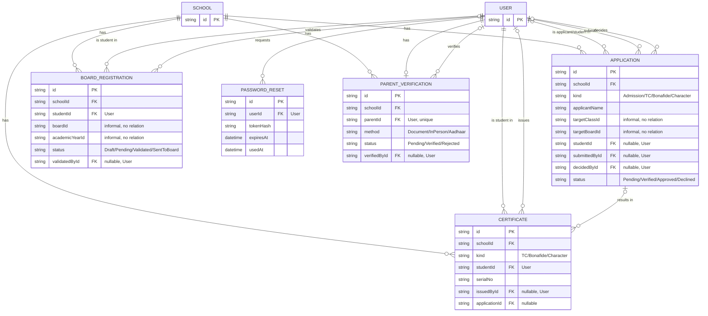

---

## 6. Finance

Full `School`/`User`/`Class`/`Term` fields are in Core & Tenancy / Academic Structure. **Accuracy note**: `FeeHead` is referenced only inside the `lines` JSON blobs on `FeeStructure` (`[{ feeHeadId, amount }]`) and `FeeInvoice` (`[{ feeHeadId, name, amount }]`) — there is no declared Prisma relation from either model to `FeeHead`, so no line is drawn for it below.

```mermaid
erDiagram
    SCHOOL { string id PK }
    USER { string id PK }
    CLASS { string id PK }
    TERM { string id PK }

    FEE_HEAD {
        string id PK
        string schoolId FK
        string name
        boolean isRecurring
    }
    FEE_STRUCTURE {
        string id PK
        string schoolId FK
        string classId FK
        string termId FK
        date dueDate
        json lines "feeHeadId, amount (informal)"
    }
    FEE_INVOICE {
        string id PK
        string schoolId FK
        string studentId FK "User"
        string feeStructureId FK "nullable"
        string termId FK
        float total
        float concession
        string status "Due/PartiallyPaid/Paid/Waived"
        string invoiceNo
    }
    PAYMENT {
        string id PK
        string schoolId FK
        string invoiceId FK
        float amount
        string method "UPI/Card/NetBanking/Cash/Cheque"
        string recordedById FK "nullable, User"
        string receiptNo
    }
    FEE_REMINDER {
        string id PK
        string schoolId FK
        string invoiceId FK
        string sentById FK "nullable, User"
        string channel "InApp/Email/SMS"
    }
    SALARY_STRUCTURE {
        string id PK
        string schoolId FK
        string userId FK "User, unique"
        float basic
        json allowances
        json deductions
        date effectiveFrom
    }
    PAYSLIP {
        string id PK
        string schoolId FK
        string userId FK "User"
        string month "YYYY-MM"
        float gross
        float net
        string status "Generated/Paid"
        string paidById FK "nullable, User"
        string slipNo
    }

    SCHOOL ||--o{ FEE_HEAD : "has"
    SCHOOL ||--o{ FEE_STRUCTURE : "has"
    SCHOOL ||--o{ FEE_INVOICE : "has"
    SCHOOL ||--o{ PAYMENT : "has"
    SCHOOL ||--o{ FEE_REMINDER : "has"
    SCHOOL ||--o{ SALARY_STRUCTURE : "has"
    SCHOOL ||--o{ PAYSLIP : "has"

    CLASS ||--o{ FEE_STRUCTURE : "has"
    TERM ||--o{ FEE_STRUCTURE : "scopes"
    TERM ||--o{ FEE_INVOICE : "scopes"
    FEE_STRUCTURE |o--o{ FEE_INVOICE : "generates"
    USER ||--o{ FEE_INVOICE : "is student in"

    FEE_INVOICE ||--o{ PAYMENT : "has"
    USER |o--o{ PAYMENT : "records"
    FEE_INVOICE ||--o{ FEE_REMINDER : "has"
    USER |o--o{ FEE_REMINDER : "sends"

    USER ||--o| SALARY_STRUCTURE : "has"
    USER ||--o{ PAYSLIP : "is employee in"
    USER |o--o{ PAYSLIP : "marks paid"
```

---

## 7. HR

Full `School`/`User` fields are in Core & Tenancy.

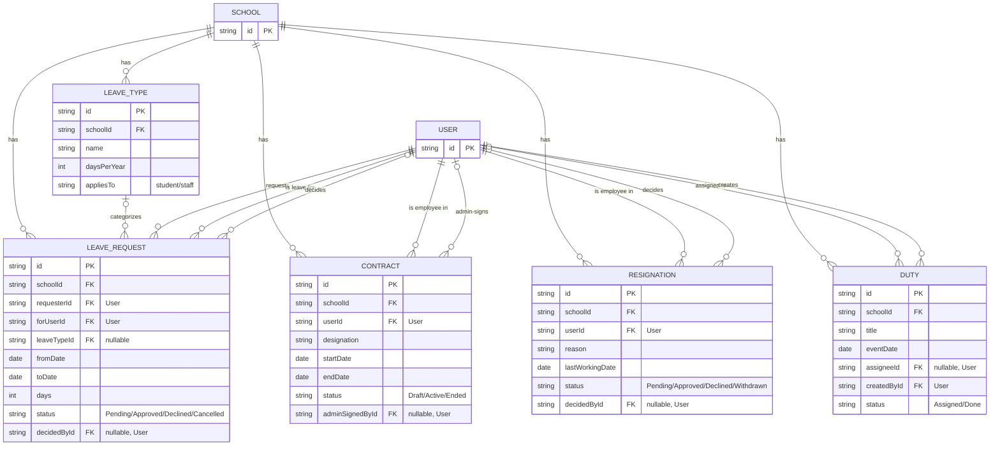

---

## 8. Communication

Full `School`/`User`/`Class`/`Term` fields are in Core & Tenancy / Academic Structure.

```mermaid
erDiagram
    SCHOOL { string id PK }
    USER { string id PK }
    CLASS { string id PK }
    TERM { string id PK }

    POST {
        string id PK
        string schoolId FK
        string authorId FK "User"
        string audience "School/Class/Role"
        string classId FK "nullable"
        string role "nullable"
        string body
        boolean pinned
        datetime publishedAt
    }
    POST_REACTION {
        string id PK
        string postId FK
        string userId FK "User"
    }
    POST_COMMENT {
        string id PK
        string postId FK
        string authorId FK "User"
        string body
    }
    CONVERSATION {
        string id PK
        string schoolId FK
        string kind "DM/Group"
        string classId FK "nullable"
        string createdById FK "User"
    }
    PARTICIPANT {
        string id PK
        string conversationId FK
        string userId FK "User"
        datetime lastReadAt
    }
    MESSAGE {
        string id PK
        string conversationId FK
        string senderId FK "User"
        string body
        datetime sentAt
    }
    NOTIFICATION {
        string id PK
        string schoolId FK
        string userId FK "User"
        string kind
        string title
        datetime readAt
    }
    MEETING {
        string id PK
        string schoolId FK
        string requesterId FK "User"
        string withUserId FK "User"
        string studentId FK "nullable, User"
        string status "Requested/Scheduled/Completed/Cancelled/Declined"
        datetime scheduledAt
        string decidedById FK "nullable, User"
    }
    CALENDAR_EVENT {
        string id PK
        string schoolId FK
        string title
        date date
        string type "holiday/exam/event"
        string audience "School/Class"
        string classId FK "nullable"
        string termId FK "nullable"
        string createdById FK "User"
    }

    SCHOOL ||--o{ POST : "has"
    SCHOOL ||--o{ CONVERSATION : "has"
    SCHOOL ||--o{ NOTIFICATION : "has"
    SCHOOL ||--o{ MEETING : "has"
    SCHOOL ||--o{ CALENDAR_EVENT : "has"

    CLASS |o--o{ POST : "scopes"
    CLASS |o--o{ CONVERSATION : "scopes"
    CLASS |o--o{ CALENDAR_EVENT : "scopes"
    TERM |o--o{ CALENDAR_EVENT : "scopes"

    USER ||--o{ POST : "authors"
    POST ||--o{ POST_REACTION : "has"
    USER ||--o{ POST_REACTION : "reacts"
    POST ||--o{ POST_COMMENT : "has"
    USER ||--o{ POST_COMMENT : "authors"

    USER ||--o{ CONVERSATION : "creates"
    CONVERSATION ||--o{ PARTICIPANT : "has"
    USER ||--o{ PARTICIPANT : "participates in"
    CONVERSATION ||--o{ MESSAGE : "has"
    USER ||--o{ MESSAGE : "sends"

    USER ||--o{ NOTIFICATION : "receives"

    USER ||--o{ MEETING : "requests"
    USER ||--o{ MEETING : "meets with"
    USER |o--o{ MEETING : "concerns student"
    USER |o--o{ MEETING : "decides"

    USER ||--o{ CALENDAR_EVENT : "creates"
```

---

## 9. Student Welfare

Full `School`/`User`/`Class` fields are in Core & Tenancy / Academic Structure.

```mermaid
erDiagram
    SCHOOL { string id PK }
    USER { string id PK }
    CLASS { string id PK }

    HEALTH_RECORD {
        string id PK
        string schoolId FK
        string studentId FK "User"
        string kind "Vaccination/Allergy/Condition/Checkup/Other"
        string title
        date date
        string addedById FK "User"
        string verifiedById FK "nullable, User"
    }
    PERMISSION_SLIP {
        string id PK
        string schoolId FK
        string title
        date dueDate
        string classId FK "nullable"
        string createdById FK "User"
        boolean requiresVerifiedParent
    }
    SLIP_RESPONSE {
        string id PK
        string slipId FK
        string studentId FK "User"
        string parentId FK "User"
        string decision "Approved/Declined"
    }
    ACHIEVEMENT {
        string id PK
        string schoolId FK
        string userId FK "User"
        string title
        date date
        string category "Academic/Sports/Arts/Service/Other"
        string verifiedById FK "nullable, User"
    }
    DISCIPLINARY_CASE {
        string id PK
        string schoolId FK
        string studentId FK "User"
        string classId FK "nullable"
        string title
        string reportedById FK "User"
        string status "Reported...Closed"
        datetime deletedAt "soft delete"
    }
    DISCIPLINARY_NOTE {
        string id PK
        string caseId FK
        string authorId FK "User"
        string body
    }
    CALL_LOG {
        string id PK
        string schoolId FK
        string studentId FK "User"
        string parentId FK "nullable, User"
        string byId FK "User"
        string reason "fee/attendance/disciplinary/general"
        string outcome
    }
    ACTIVITY {
        string id PK
        string schoolId FK
        string kind "club/house/exc/event/faculty"
        string title
        int capacity
        string createdById FK "User"
    }
    ACTIVITY_REGISTRATION {
        string id PK
        string activityId FK
        string userId FK "User"
        string status "Registered/Waitlisted/Cancelled"
    }

    SCHOOL ||--o{ HEALTH_RECORD : "has"
    SCHOOL ||--o{ PERMISSION_SLIP : "has"
    SCHOOL ||--o{ ACHIEVEMENT : "has"
    SCHOOL ||--o{ DISCIPLINARY_CASE : "has"
    SCHOOL ||--o{ CALL_LOG : "has"
    SCHOOL ||--o{ ACTIVITY : "has"

    USER ||--o{ HEALTH_RECORD : "is student in"
    USER ||--o{ HEALTH_RECORD : "adds"
    USER |o--o{ HEALTH_RECORD : "verifies"

    CLASS |o--o{ PERMISSION_SLIP : "scopes"
    USER ||--o{ PERMISSION_SLIP : "creates"
    PERMISSION_SLIP ||--o{ SLIP_RESPONSE : "has"
    USER ||--o{ SLIP_RESPONSE : "is student in"
    USER ||--o{ SLIP_RESPONSE : "is parent in"

    USER ||--o{ ACHIEVEMENT : "owns"
    USER |o--o{ ACHIEVEMENT : "verifies"

    USER ||--o{ DISCIPLINARY_CASE : "is student in"
    CLASS |o--o{ DISCIPLINARY_CASE : "scopes"
    USER ||--o{ DISCIPLINARY_CASE : "reports"
    DISCIPLINARY_CASE ||--o{ DISCIPLINARY_NOTE : "has"
    USER ||--o{ DISCIPLINARY_NOTE : "authors"

    USER ||--o{ CALL_LOG : "is student in"
    USER |o--o{ CALL_LOG : "is parent in"
    USER ||--o{ CALL_LOG : "makes"

    USER ||--o{ ACTIVITY : "creates"
    ACTIVITY ||--o{ ACTIVITY_REGISTRATION : "has"
    USER ||--o{ ACTIVITY_REGISTRATION : "registers"
```

---

## 10. AI & Integrations

Full `School`/`User`/`Subject`/`Class`/`File` fields are in Core & Tenancy / Academic Structure / Attendance & Assessment.

```mermaid
erDiagram
    SCHOOL { string id PK }
    USER { string id PK }
    SUBJECT { string id PK }
    CLASS { string id PK }
    FILE { string id PK }

    AI_CONVERSATION {
        string id PK
        string schoolId FK
        string studentId FK "User"
        string subjectId FK "nullable"
        string title
    }
    AI_MESSAGE {
        string id PK
        string conversationId FK
        string role "user/assistant"
        string content
    }
    HIGHLIGHT {
        string id PK
        string schoolId FK
        string title
        string url
        string thumbnailFileId FK "nullable"
        string audience "School/Class"
        string classId FK "nullable"
        string createdById FK "User"
    }
    PUSH_SUBSCRIPTION {
        string id PK
        string userId FK "User"
        string endpoint
        string p256dh
        string auth
    }

    SCHOOL ||--o{ AI_CONVERSATION : "has"
    SCHOOL ||--o{ HIGHLIGHT : "has"

    USER ||--o{ AI_CONVERSATION : "is student in"
    SUBJECT |o--o{ AI_CONVERSATION : "scopes"
    AI_CONVERSATION ||--o{ AI_MESSAGE : "has"

    FILE |o--o{ HIGHLIGHT : "thumbnails"
    CLASS |o--o{ HIGHLIGHT : "scopes"
    USER ||--o{ HIGHLIGHT : "creates"

    USER ||--o{ PUSH_SUBSCRIPTION : "has"
```

---

## 11. Employee Management

Full `School`/`File` fields are in Core & Tenancy / Attendance & Assessment. `User.reportsTo` and `User.employeeId` (defined on `User` in Core & Tenancy) are shown here as fields on the `USER` stub since this domain is what they support.

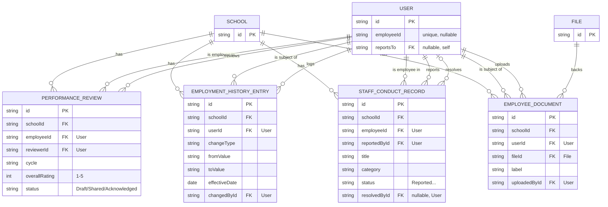

---

## 12. Transport

Full `School`/`User` fields are in Core & Tenancy. Driver/conductor are plain contact fields on `Vehicle`, not their own `User` accounts (the optional `driverUserId` link is for when a driver happens to also be staff).

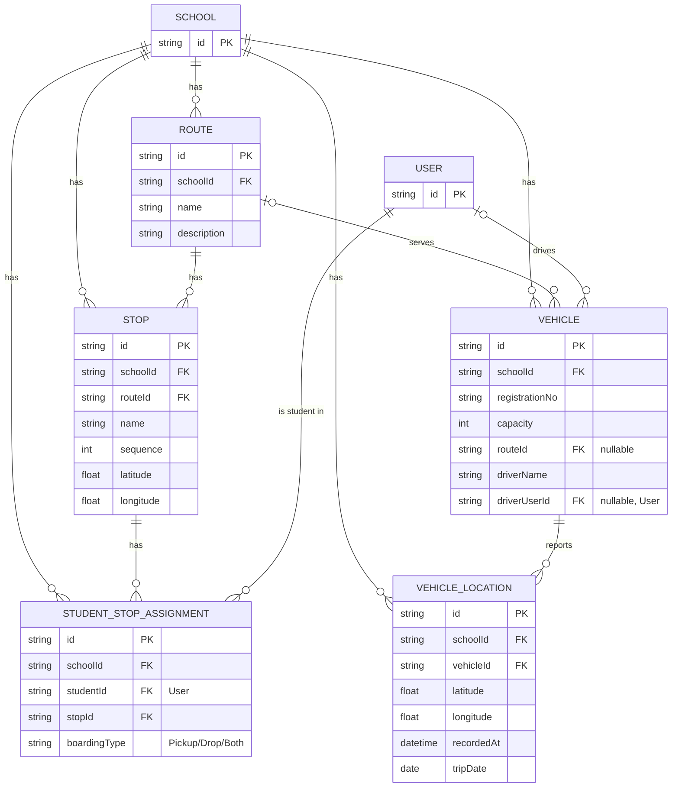

---

## 13. Alumni

Full `School`/`User` fields are in Core & Tenancy. Alumni are deliberately not `User` accounts — `studentUserId` is only an optional back-link to the original student login.

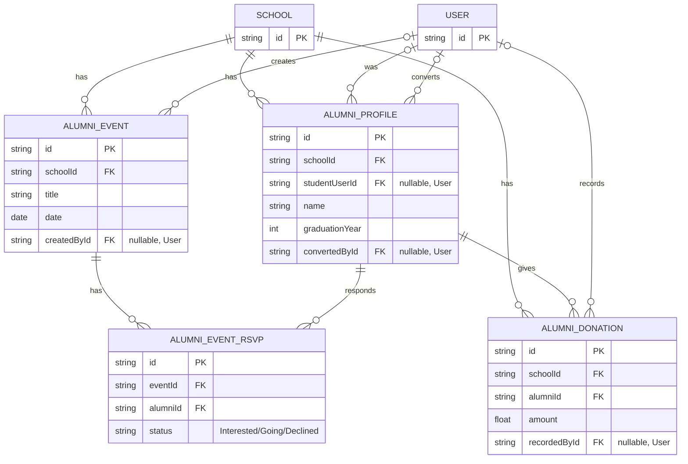

---

## 14. Hostel

Full `School`/`User` fields are in Core & Tenancy. `wardenUserId` is an optional link to an existing staff/teacher/admin account, not a new "warden" role.

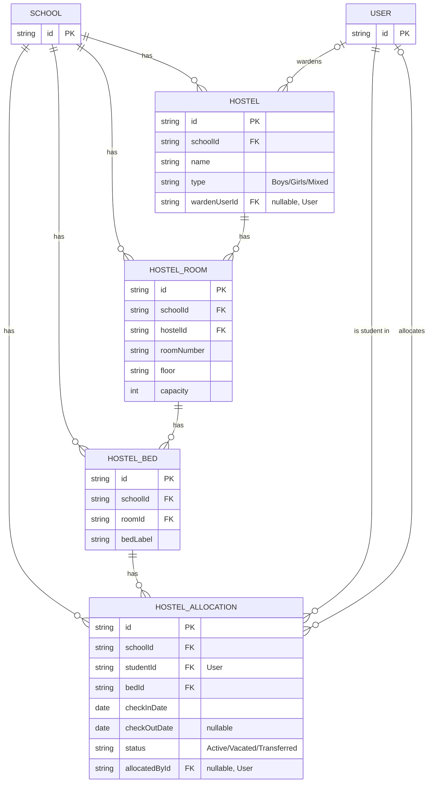

---

## 15. Library

Full `School`/`User`/`File` fields are in Core & Tenancy / Attendance & Assessment. `borrowerId` on `Loan` may be a student or staff/teacher `User`.

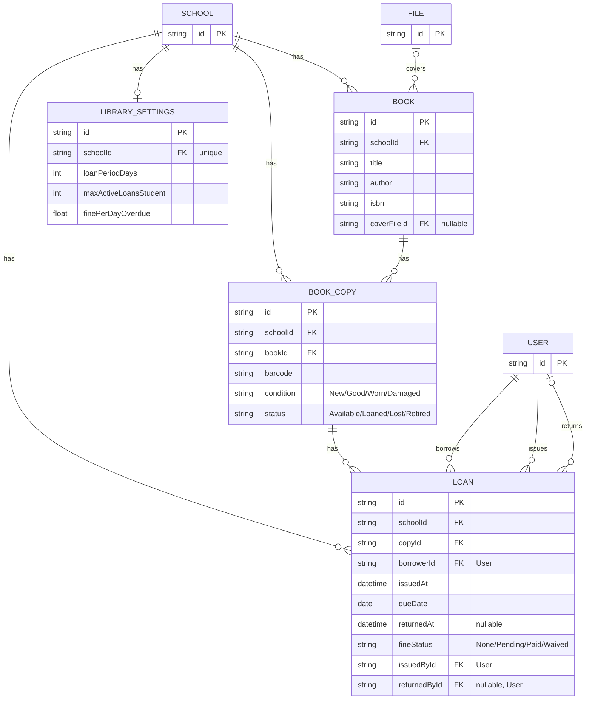

---

## 16. Inventory & Procurement

Full `School`/`User` fields are in Core & Tenancy. `InventoryItem.currentStock` is denormalized and, by application-level convention, only ever changed via a `StockMovement` write.

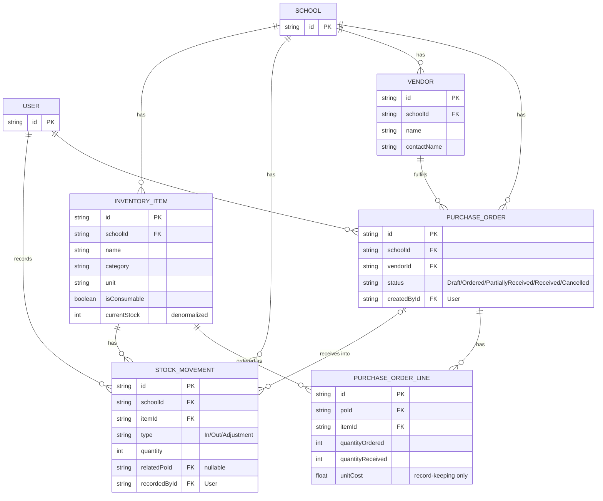

---

## 17. Accounting

Full `School`/`User` fields are in Core & Tenancy. **Accuracy note**: `JournalEntry.sourceId` is a "polymorphic-by-convention" id (pointing at a `Payment` or `Payslip` row depending on `sourceType`) — it is explicitly **not** a real Prisma relation, so no line is drawn for it.

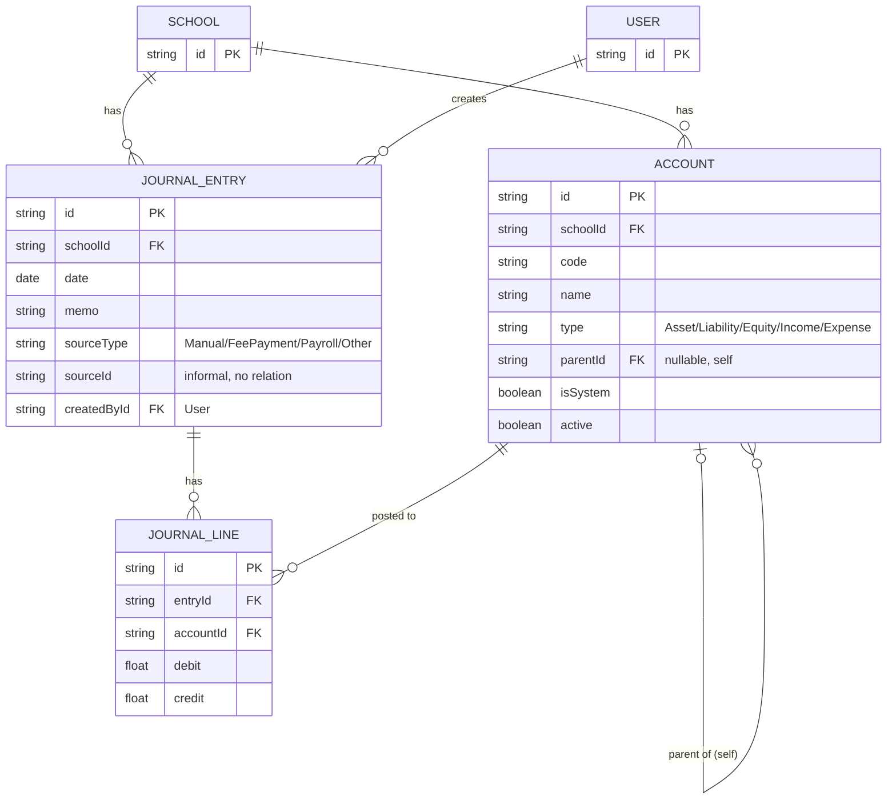

---

## 18. Audit

Full `School` fields are in Core & Tenancy. **Accuracy note**: `AuditLog.actorId` is a plain `String` with no declared relation to `User` (there is no `actor User @relation(...)` field) — it is an informally-recorded id, not an enforced foreign key.

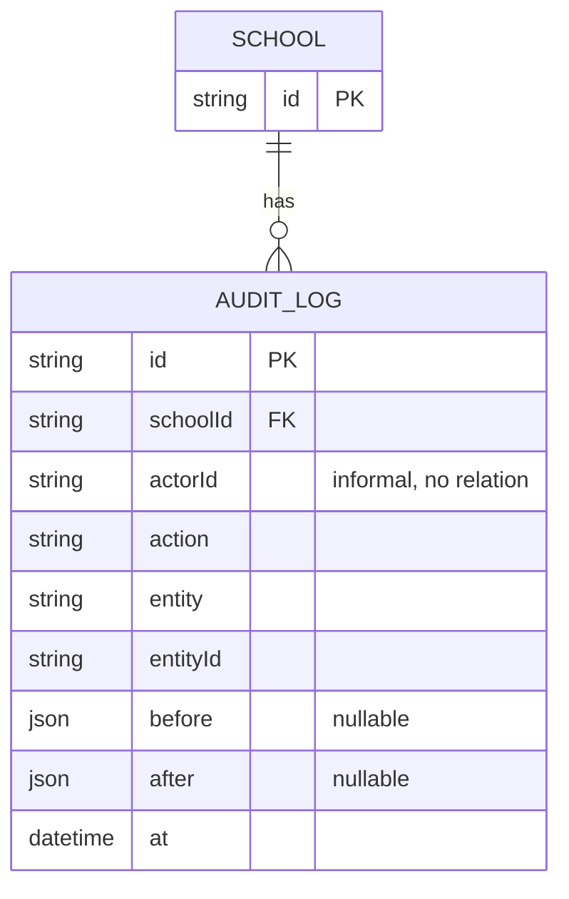

---

## Domain Map

A simplified, conceptual view of how the 18 domains relate — not a full ER diagram. Solid arrows are real, enforced relationships (Prisma `@relation`); dashed arrows are looser, convention-based or purely tenant-scoping links.

```mermaid
flowchart TD
    CORE["Core & Tenancy<br/>School, User, Session"]
    ACAD["Academic Structure"]
    TT["Timetable"]
    ATT["Attendance & Assessment"]
    ADM["Admissions & Identity"]
    FIN["Finance"]
    HR["HR"]
    COMM["Communication"]
    WELF["Student Welfare"]
    AI["AI & Integrations"]
    EMP["Employee Management"]
    TRANS["Transport"]
    ALUM["Alumni"]
    HOST["Hostel"]
    LIB["Library"]
    INV["Inventory & Procurement"]
    ACC["Accounting"]
    AUD["Audit"]

    CORE -->|schoolId + User FKs| ACAD
    CORE -.->|schoolId on every model| TT
    CORE -.->|schoolId on every model| ATT
    CORE -.->|schoolId on every model| ADM
    CORE -.->|schoolId on every model| FIN
    CORE -.->|schoolId on every model| HR
    CORE -.->|schoolId on every model| COMM
    CORE -.->|schoolId on every model| WELF
    CORE -.->|schoolId on every model| AI
    CORE -.->|schoolId on every model| EMP
    CORE -.->|schoolId on every model| TRANS
    CORE -.->|schoolId on every model| ALUM
    CORE -.->|schoolId on every model| HOST
    CORE -.->|schoolId on every model| LIB
    CORE -.->|schoolId on every model| INV
    CORE -.->|schoolId on every model| ACC
    CORE -.->|schoolId on every model| AUD

    ACAD -->|Class, Term, ClassSubject| TT
    ACAD -->|Class, Term, ClassSubject| ATT
    ACAD -->|Class, Term| FIN
    ACAD -->|Class scoping| COMM
    ACAD -->|Class scoping| WELF
    ACAD -->|Subject, Class scoping| AI

    ADM -.->|approved Application becomes a student| ACAD

    HR -->|shared User-as-employee| EMP
    HR -->|SalaryStructure/Payslip| FIN

    FIN -.->|sourceType/sourceId, informal| ACC
    INV -.->|PO cost, record-keeping only| ACC

    TRANS -->|studentId| CORE
    ALUM -->|studentUserId, optional| CORE
    HOST -->|studentId| CORE
    LIB -->|borrowerId| CORE

    AUD -.->|entity/entityId log of actions across| CORE
    AUD -.->|entity/entityId log of actions across| ACAD
    AUD -.->|entity/entityId log of actions across| FIN
    AUD -.->|entity/entityId log of actions across| HR
```

---

## Model count check

Across the 18 groups above: 3 + 12 + 4 + 9 + 5 + 7 + 5 + 9 + 9 + 4 + 4 + 5 + 4 + 4 + 4 + 5 + 3 + 1 = **97 models**, matching the schema's actual model count exactly (verified by reading `server/prisma/schema.prisma` in full, line by line — no models were skipped or guessed at). No uncategorized models remain.

## How to regenerate

This document was hand-derived from `server/prisma/schema.prisma` (2334 lines, 97 models) as of the date it was written, and is meant to be a **readable, curated reference** — not a raw dump. If the schema changes significantly (new models, renamed fields, changed relations/nullability), this file should be manually reviewed and updated to match; it will silently go stale otherwise since nothing regenerates it automatically.

If the team ever wants an always-current, exhaustive view instead of a curated one, Prisma can generate that directly from the live schema:
- `npx prisma db pull` (or `prisma migrate diff`) against `server/prisma/schema.prisma` for a raw SQL view, or
- a DBML/ERD export via a community generator (e.g. `prisma-dbml-generator`) added to the `generator` block in `schema.prisma`.

Either approach will always match the database exactly, but produces a far less readable, non-grouped artifact than this document — the two are complementary, not substitutes for each other.
